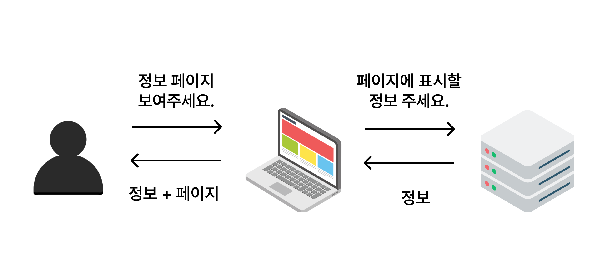

## Mpersand 2차 과제

### 애플리케이션의 전체적인 구조를 구성.
###  Front-end
* 웹사이트나 웹 애플리케이션의 사용자 인터페이스(UI)를 개발합니다. 이는 사용자가 웹 페이지를 효과적으로 탐색하고 상호작용할 수 있도록 합니다.
* HTML, CSS, JavaScript를 사용하여 웹 페이지를 디자인하고 구현합니다. 이들은 웹 페이지의 구조, 스타일 및 동작을 정의합니다.
* 최근에는 React, Vue.js, Angular와 같은 프론트엔드 프레임워크 및 라이브러리를 사용하여 웹 애플리케이션을 더욱 동적으로 만드는 추세입니다.

###  Back-end
* 주로 서버 측에서 작업하며, 데이터 처리, 비즈니스 로직, 사용자 인증, 보안 등을 담당합니다.
* Java(Spring, Spring Boot), Python(Django, Flask), Ruby on Rails, Node.js(Express.js) 등의 프레임워크를 사용하여 백엔드 서비스를 구축합니다.
* 데이터베이스와의 상호작용을 담당하여 사용자 요청에 대한 데이터를 처리하고 저장합니다.
---
### 프론트 엔드와 백엔드 연결 원리 및 상호작용 방법

#### 연결 원리

 * HTTP 프로토콜: 프론트엔드와 백엔드는 대개 HTTP(HyperText Transfer Protocol)를 통해 통신한다.

* API (Application Programming Interface): 백엔드 서버는 특정 엔드포인트를 통해 데이터나 기능을 제공하며, 프론트엔드는 이 엔드포인트에 요청을 보내 데이터를 받거나 처리한다.

* 비동기 통신: 현대 웹 앱에서는 AJAX(Asynchronous JavaScript and XML)나 Fetch API, Axios 등을 사용하여 비동기적으로 데이터를 주고 받는다.

#### 연결 방법
* RESTful API: 가장 일반적인 방법으로, 백엔드에서 RESTful 원칙을 따르는 API를 제공하고, 프론트엔드에서는 이 API를 호출한다.
예: GET /users, POST /users

* GraphQL: 요즘 많이 사용되는 새로운 기술로, 프론트엔드에서 필요한 데이터 형식을 지정하여 요청할 수 있다.

* WebSocket: 실시간 통신이 필요한 경우 사용되며, HTTP보다 더 빠른 양방향 통신을 지원한다.

* Server-Sent Events (SSE): 서버에서 클라이언트로 실시간으로 데이터를 전송할 때 사용된다.

-------

### 모바일 플랫폼에 맞게 최적화.

### iOS-developer
* 애플의 iOS 플랫폼을 기반으로 앱을 개발합니다. 이는 iPhone, iPad 등의 Apple 기기에서 동작합니다.
* Swift 또는 Objective-C 언어를 사용하여 iOS 애플리케이션을 디자인하고 구현합니다. Apple의 특정 기능과 프레임워크를 활용하여 사용자 경험을 향상시킵니다.

### Android-developer
* 구글의 안드로이드 플랫폼을 기반으로 한 애플리케이션을 개발합니다. 이는 다양한 안드로이드 기기에서 실행됩니다.
* Java 또는 Kotlin 언어를 사용하여 Android 애플리케이션을 디자인하고 구현합니다. Google의 Android SDK와 Android Studio를 사용하여 개발환경을 구성합니다.

----
### 개발 및 운영 프로세스를 통합.

### DevOps-engineer
* 소프트웨어 개발과 운영을 통합하는 역할을 수행합니다. 이는 개발 및 운영 팀 간의 협업을 강화하고 소프트웨어 개발 프로세스를 자동화하는 것을 포함합니다.
* CI/CD, 자동화, 모니터링 및 인프라 관리와 같은 작업을 수행하여 개발 및 운영 프로세스를 효율적으로 관리합니다.

---
### 사용자 중심의 인터페이스를 디자인.

### Designer
* 사용자 인터페이스(UI) 및 사용자 경험(UX) 디자인을 담당합니다. 웹사이트, 앱 또는 다른 디지털 제품의 시각적인 요소를 디자인하고 사용자들의 편의성을 고려하여 디자인을 개선합니다.
* Adobe XD, Sketch, Figma와 같은 디자인 도구를 사용하여 프로토타입을 만들고 사용자 피드백을 통해 디자인을 개선합니다.